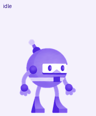

# Dot — your purple robot companion

Dot is a purple robot coding companion inspired by a .NET robot reference. It has a calm blink, a hover jump, task reactions, and sixteen look directions.



**[Adopt Dot through ChatGPT Pets](https://chatgpt.com/s/sharepet_6ac608219b8081918a7bff00e61c3087)** · [Sprite sheet](assets/dot.png) · [Look preview](previews/look-loop.gif)

## Install by giving this repository to an agent

Copy this prompt into Codex or another agent:

```text
Read https://github.com/sannlynnhtun-coding/dot-pet/blob/main/README.md
and install Dot as my active personal pet. Follow its Pets adoption workflow
when Pets tools are available. Otherwise clone the repository, verify the
sprite asset, and open the local preview. Tell me whether native pet selection
was completed or only the local preview is available.
```

Reading the repository alone does not install anything. Your request above authorizes the agent to install and select Dot. The host needs the Pets plugin and authenticated Pets tools for native adoption. An agent without those tools can download and preview Dot; native integration in a different app requires that app's own pet or avatar API.

## Route 1 — adopt and select with Pets

1. Open a chat in a host that supports the **Pets** plugin and enable it. This repository contains artwork and an installation skill; it does not install the Pets plugin itself.
2. Give the agent the installation prompt above, or ask: **“Adopt this pet and select it: https://chatgpt.com/s/sharepet_6ac608219b8081918a7bff00e61c3087”**.
3. The agent calls `adopt` with `shared_pet_id: "sharepet_6ac608219b8081918a7bff00e61c3087"`.
4. It reads the new user-owned pet ID from the adoption response. That ID belongs to your account; do not use the creator's private pet ID.
5. It calls `select_pet` with the new ID.
6. It checks that `active_pet_id` matches, then uses `list_pets` to verify the new pet and its active state. Follow pagination if necessary.
7. Dot is ready in the host's supported pet surface. If adoption fails, report the returned error rather than claiming installation succeeded.

Tool names may have host-specific prefixes, for example `mcp__codex_apps__pets_adopt`. Discover tools by capability instead of assuming a shell command exists. A shared-pet link installs a new copy; repeat adoption can create duplicates. Reuse an existing installation when its local account-specific installation record or verified metadata identifies it unambiguously.

## Route 2 — clone and preview locally

This route works with ordinary coding agents and does not need Pets tools.

1. Clone the public repository:

   ```sh
   git clone https://github.com/sannlynnhtun-coding/dot-pet.git
   cd dot-pet
   ```

2. Check the asset checksum and PNG dimensions:

   ```sh
   python scripts/verify_asset.py
   # macOS/Linux may use python3 instead of python
   ```

3. Start the local preview server:

   ```sh
   python -m http.server 8765 --bind 127.0.0.1
   ```

4. Open [the preview](http://127.0.0.1:8765/preview.html). Choose an animation or a look direction.
5. Stop the server with `Ctrl+C` when finished.

The preview displays the actual sprite sheet. It does not change Codex, ChatGPT, or another application's active pet. No API key, package install, or account credentials are needed for this route.

## Agent skill

The repository includes [`.agents/skills/install-dot/SKILL.md`](.agents/skills/install-dot/SKILL.md). An agent can read that skill after you explicitly request installation. Hosts that discover repository skills may expose it as `install-dot`; other hosts can follow the same file manually.

[AGENTS.md](AGENTS.md) defines the installation scope. The skill adopts the existing validated artwork; it does not regenerate a mascot or edit unrelated settings.

## If the share link stops working

The creator can revoke the public share link. The repository's PNG remains available independently.

1. Download or clone `assets/dot.png` and run `scripts/verify_asset.py`.
2. Ask a Pets-enabled agent to import that existing sheet and select it.
3. The agent must follow its installed Pets import/create guidance, call `validate_pet_spritesheet` on the absolute local file path, and continue only when `valid: true`.
4. It calls `prepare_pet_upload` with the same file, then `create_pet` with the returned nested `upload.upload_session_id`, name `Dot`, and the description from `pet.json`.
5. It selects the returned new ID and verifies the active state. A shell script cannot call these authenticated host tools on its own.

## Integrate with another pet renderer

Use [pet.json](pet.json) as the portable asset manifest. The sprite is a transparent PNG with **1536 × 2288** pixels, **8 columns × 11 rows**, and **192 × 208** pixel cells.

| Row | State | Used frames |
| --- | --- | --- |
| 0 | idle | 6 |
| 1 | running-right | 8 |
| 2 | running-left | 8 |
| 3 | waving | 4 |
| 4 | jumping | 5 |
| 5 | failed | 8 |
| 6 | waiting | 6 |
| 7 | running / active work | 6 |
| 8 | review | 6 |
| 9 | look 000–157.5° | 8 |
| 10 | look 180–337.5° | 8 |

For cell `(column, row)`, crop `(column × 192, row × 208, 192, 208)`. Standard rows use only their listed leftmost cells; unused cells are transparent. `000°` is up, `090°` screen-right, `180°` down, and `270°` screen-left. Neutral is the idle pose. Use manifest durations to play standard animations; look frames are static directional poses.

The generic preview is tested with the checked-in asset. Automatic installation into arbitrary agent apps is not implemented; an adapter must connect the manifest to the target app's supported rendering API.

## Validation and files

- `assets/dot.png` — validated v2 sprite sheet, 73 required poses.
- `pet.json` — portable identity, public adoption ID, format, frame counts, timing, and checksum.
- `preview.html` — dependency-free browser renderer.
- `previews/` — animations, contact sheet, and direction review.
- `validation.json` — creation quality report; structural, jump, registration, and direction checks passed. Mild intermediate direction warnings were visually reviewed.

The original reference image and private account-specific installation ID are not included. There are no credentials or expiring download URLs in this repository.

## Credits and reuse

Created using the Pets creation workflow and generated artwork. The supplied reference inspired the purple robot design; Dot's badge is unlettered. This is a coding companion project and does not claim affiliation with Microsoft or OpenAI. Public availability enables the installation flow above; no separate broad redistribution license is declared in this repository.
